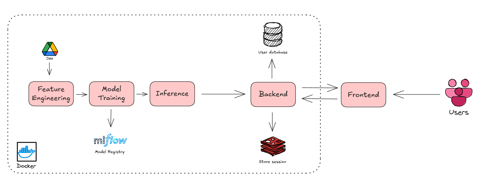

# 😴 Sleep Efficiency App  

A web application that utilizes a machine learning pipeline to predict a person's sleep efficiency score. This project helps users analyze their sleep quality and gain insights to improve their habits.  

## 📖 Table of Contents
- [🎥 Demo](#-demo)
- [⚙️ Features](#-features)
- [🛠️ Tech Stack](#-tech-stack)
- [🚀 Deployment](#-deployment)
- [🤝 Contributing](#-contributing)
- [📃 License](#-license)

## 🎥 Demo

## ⚙️ Features

- **User Authentication:** Secure sign-up and sign-in functionality.  
- **Sleep Efficiency Prediction:** Machine learning-based predictions for sleep efficiency.  

## 🛠️ Tech Stack  

This project utilizes the following technologies:

- **Frontend:**  
  - React.js  
  - TypeScript  

- **Backend:**  
  - Flask  
  - Redis - User session management  
  - Supabase - User authentication & database  

- **Machine Learning:**  
  - XGBoost
  - MLflow - Model tracking and experiment  

- **Deployment:**  
  - Docker  
  - AWS EC2
  - GitHub Actions - CI/CD  

## 🚀 Deployment

### 1. Login to AWS console

### 2. Create IAM user for deployment

    # Description: About the deployment

    1. Build docker image of the source code

    2. Push your docker image to ECR

    3. Launch your EC2 

    4. Pull your image from ECR in EC2

    5. Lauch your docker image in EC2

    #Policy:

    1. AmazonEC2ContainerRegistryFullAccess

    2. AmazonEC2FullAccess

### 3. Create ECR repo to store/save docker image

- Save the URI: 273354663421.dkr.ecr.us-east-1.amazonaws.com/sleepefficiency

### 4. Create EC2 machine (Ubuntu)

### 5. Open EC2 and Install docker in EC2 Machine:

	#optinal

	sudo apt-get update -y

	sudo apt-get upgrade
	
	#required

	curl -fsSL https://get.docker.com -o get-docker.sh

	sudo sh get-docker.sh

	sudo usermod -aG docker ubuntu

	newgrp docker

### 6. Configure EC2 as self-hosted runner:
    setting> actions> runner> new self hosted runner> choose os> then run command one by one

### 7. Setup github secrets:

    AWS_ACCESS_KEY_ID=

    AWS_SECRET_ACCESS_KEY=

    AWS_REGION = us-east-1

    ECR_REPOSITORY_NAME = sleepefficiency

## 🤝 Contributing

This project is open to contributions. Please feel free to submit a PR.

## 📃 License

This project is provided under an MIT license. See the [LICENSE](LICENSE) file for details.